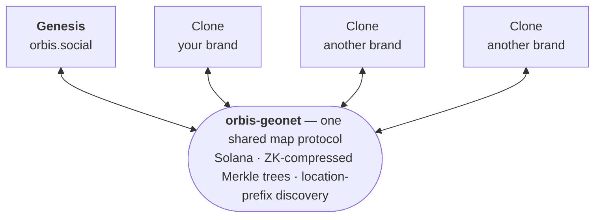

# Orbis Geographical Internet (GeoNet)

**[Orbis](https://orbis.social)** is a [geo-social network](https://en.wikipedia.org/wiki/Geosocial_networking) in which communities collaboratively map their cultural identity over physical space: tribal territories are amorphous polygons computed in real time from collective territorial claims. It is an applied computer-science research program in geospatial computing and decentralized cultural infrastructure, funded by [FAPESP PIPE I and II](https://bv.fapesp.br/en/auxilios/111929/orbis-geolocation-social-network-and-collaborative-urban-mapping/).

Orbis is an incipient prototype for the territorialization of a network society ([Carnoy & Castells, 2001](https://onlinelibrary.wiley.com/doi/10.1111/1471-0374.00002)) and a **GeoNet** — a geographical layer of the internet ([Graham, 2013](https://doi.org/10.1111/geoj.12009); [Kitchin & Dodge, 2011](https://direct.mit.edu/books/oa-monograph/5039/Code-SpaceSoftware-and-Everyday-Life)), in the lineage of [Vernadsky's noosphere (*ноосфера*, 1944)](https://vernadsky.lib.ru/e-texts/archive/noos.html). It supplies the spatial substrate the network-society literature presupposes: the cartographic primitives by which a digitally-constituted community claims physical ground without administrative inscription — [Milton Santos's (1996)](https://www.edusp.com.br/livros/natureza-do-espaco/) coupling of systems of objects and systems of actions (*sistemas de objetos e sistemas de ações*); [Sundaram's (2010)](https://www.routledge.com/Pirate-Modernity-Delhis-Media-Urbanism/Sundaram/p/book/9780415611749) re-territorialization from below. The territory-fusion algorithm operationalizes [Deleuze & Guattari's (1980)](https://www.leseditionsdeminuit.fr/livre-Capitalisme_et_schizophr%C3%A9nie_2___Mille_plateaux-2015-1-1-0-1.html) *territorialisation / déterritorialisation* dialectic as a [cosmotechnics (Hui, 2016)](https://www.urbanomic.com/book/question-concerning-technology-china/) of collective mapping.

---

## From polygons to a GeoNet

The [territory-fusion research](https://github.com/orbis-geonet/research) is what makes this concrete. Each community stakes claims to real-world places, and thousands of claims are fused in real time into organic tribal polygons — tangent bridges connect nearby claims, collisions between rival groups reject a merge, and the hole-preserving union keeps interior gaps intact. A territory is addressed by the claims it contains, and fusion and split are first-class idempotent operations. These are the cartographic primitives of a *geographical* internet: where the internet addresses information by IP, a GeoNet addresses **ground by claim** — a community draws, holds, and federates territory directly on the map, with no central cadastre. In the [orbis-geonet protocol](https://orbis.social/network), those territories become permissionlessly federable: proofs and geo-tagged pointers live in ZK-compressed Merkle trees on Solana, discovery is by location-prefix, and independent clones sync ground-to-ground in a [native token](https://orbis.social/exchange) — the geographical layer of the internet, run by its inhabitants.

  
  &nbsp;&nbsp;
  

<em>The territory-fusion algorithm (left, from the <a href="https://github.com/orbis-geonet/research">research</a>) rendered live as tribal territories on the map in the app (right).</em>

---

## Become an Orbis clone node operator

This organization exists to help **clone operators** create their own **branded** clone of the Orbis app and connect it to the [**orbis-geonet**](https://orbis.social/network) — the permissionless, federated network where independent clones share one map protocol and sync territory to one another. It is equally where operators and contributors improve the common project: suggest features, report and fix bugs, and refine the protocol together. [orbis.social](https://orbis.social) is the Genesis reference instance; the repositories below — iOS, Android, web, backend — are what you fork to run your own, and the *Clone* rows in the table await federated operators.

<em>Independent, branded clones federate through one shared map protocol — syncing territory to one another to form the GeoNet.</em>

**Accessible, and priced at the network minimum.** Spinning up a clone needs no permission: fork the stack below, rebrand it, deploy it, and register your clone on-chain — a one-time **50 [$ORBIS](https://orbis.social/exchange) (≈ $50)** — to join the federation. From then on, writes are **batched**: the worker bundles up to **200 user actions (plus 32 collection updates) into a single on-chain write**, which costs a flat **0.0001 $ORBIS** ($0.0001, since $ORBIS is pegged to $1.00) plus the Solana network minimum (~0.000005 SOL per batch). No tiers — the same for a hobby clone and a global one.

| Users on your clone | Actions / month | Batches (~200 each) | Protocol fee ($ORBIS) | Network (SOL) | ≈ Total / month |
|---|---|---|---|---|---|
| 1,000 | ~50K | ~250 | 0.025 $ORBIS · $0.03 | ~0.00125 SOL · ~$0.10 | **~$0.13** |
| 10,000 | ~500K | ~2,500 | 0.25 $ORBIS · $0.25 | ~0.0125 SOL · ~$1 | **~$1.25** |
| 100,000 | ~5M | ~25,000 | 2.5 $ORBIS · $2.50 | ~0.125 SOL · ~$10 | **~$12.50** |
| 1,000,000 | ~50M | ~250,000 | 25 $ORBIS · $25 | ~1.25 SOL · ~$100 | **~$125** |

<em>Assumes ~50 actions per active user / month, batched at ~200 actions per on-chain write (per the <code>sync_collection_batch</code> contract). Fees from the <a href="https://orbis.social/network">network dashboard</a> at 1 $ORBIS = $1.00 and SOL ≈ $80. A million-user clone costs about <strong>$125 / month — roughly $0.000125 per active user</strong>. Cost is never a barrier to running a clone.</em>

**Clones pay each other for data — so the network funds its own hosting.** Each clone stores its own users' posts and media and serves them to the rest of the federation on demand. When one clone's users encounter data or media hosted by another, the requesting clone pays the **clone operator** in **$ORBIS** through an on-chain **streaming escrow**: the requester locks $ORBIS naming the clone operator (`init_streaming_escrow`), and the clone operator draws payment **metered per MB actually served** (`claim_streaming_payment` — `mb = data_size / 1 MB`, `fee = mb × fee_per_mb` at **0.0001 $ORBIS/MB**, minimum 0.0001 $ORBIS), each claim signed by the requester so no one overpays. The clone operator keeps **99%**; the remaining **1% funds the protocol treasury — which pays for the continued open-source development of these repositories** (the clients, backend, and protocol every operator forks). Only clone operators with an on-chain **trust score ≥ 500** can be paid, so reliable hosting is rewarded.

Crucially, per the contract a clone **only pays for the media its own users actually encounter** — fetched on demand and then cached, so it's paid for once and never re-charged — **not for the whole network's data.** Mirroring everything is optional (running a full **genesis** clone) and is not required to operate. So a clone's data cost tracks only what its users view, while hosting the content those users create becomes a revenue stream — which is what keeps information and media available across the GeoNet with no central CDN.

*Example — what a **clone operator** earns when other clones' users pull media it stores (0.0001 $ORBIS/MB, 1 $ORBIS = $1.00; clone operator keeps 99%):*

| Media pulled from a clone operator / month | Requesters pay | Operator keeps (99%) | Treasury (1%) |
|---|---|---|---|
| 10 GB | ~1.0 $ORBIS · ~$1 | ~$1.01 | ~$0.01 |
| 100 GB | ~10.2 $ORBIS · ~$10 | ~$10.14 | ~$0.10 |
| 1 TB | ~105 $ORBIS · ~$105 | ~$103.80 | ~$1.05 |
| 10 TB | ~1,049 $ORBIS · ~$1,049 | ~$1,038 | ~$10.49 |

<em>Metered per the <code>claim_streaming_payment</code> contract. A clone pays only for what its own users encounter (cached, paid once); a clone operator earns $ORBIS whenever the federation pulls its content — so hosting pays for itself.</em>

**Cache it once, then earn from it.** When a clone fetches foreign content, it can keep a local copy — and once it holds that copy it registers as a **source** for it (`register_clone` + `sync_collection_batch`), so it **never pays for the same content twice** and begins **earning $ORBIS** whenever another clone's users pull it. Every clone can serve what it holds, so the economy runs both ways: an operator **spends $ORBIS to capture content** its users want from other operators, and **receives $ORBIS** from every operator whose users fetch the content it created or cached. Replicating the whole network is optional (Mirror-full or Genesis modes) and never required to run a clone. And the $ORBIS a clone earns is liquid — it swaps to **SOL** any time on the [$ORBIS exchange](https://orbis.social/exchange).

---

|  | Website | iPhone App | Android App |
|---|---|---|---|
| Genesis | [orbis.social](https://orbis.social) | [App Store](https://apps.apple.com/ca/app/orbis-digital-tribes/id1453025529) | [Google Play](https://play.google.com/store/apps/details?id=com.orbis.orbis) |
| Clone 1 | | | |
| Clone 2 | | | |
| Clone 3 | | | |

---

## Research

| Repository | Description |
|---|---|
| [research](https://github.com/orbis-geonet/research) | Lorem ipsum dolor sit amet, consectetur adipiscing elit. |

## Front End — Mobile

| Repository | Description |
|---|---|
| [ios-app](https://github.com/orbis-geonet/ios-app) | Lorem ipsum dolor sit amet, consectetur adipiscing elit. |
| [android-app](https://github.com/orbis-geonet/android-app) | Sed do eiusmod tempor incididunt ut labore et dolore magna aliqua. |

## Front End — Web

| Repository | Description |
|---|---|
| [website](https://github.com/orbis-geonet/website) | Quis autem vel eum iure reprehenderit qui in ea voluptate velit. |
| [user-management-dashboard](https://github.com/orbis-geonet/user-management-dashboard) | User management dashboard. |
| [dynamic-site-map](https://github.com/orbis-geonet/dynamic-site-map) | Orbis dynamic site map. |

## Back End

| Repository | Description |
|---|---|
| [backend](https://github.com/orbis-geonet/backend) | Back-end services and blockchain integration (node and Java workers). |
| [polygon-creator](https://github.com/orbis-geonet/polygon-creator) | Neque porro quisquam est qui dolorem ipsum quia dolor sit amet. |

## Marketing

| Repository | Description |
|---|---|
| [email-marketing-dashboard](https://github.com/orbis-geonet/email-marketing-dashboard) | Email marketing software dashboard. |
| [marketing](https://github.com/orbis-geonet/marketing) | Social media short-form video marketing pipeline. |
